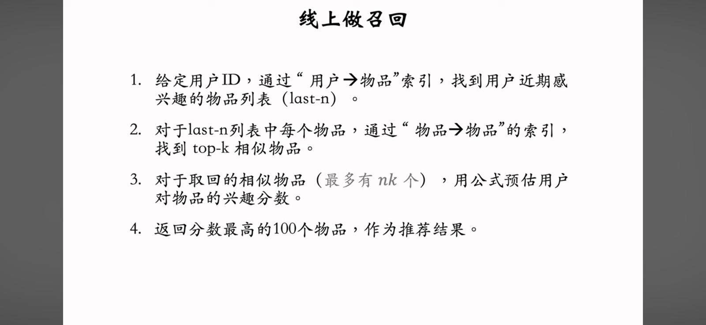
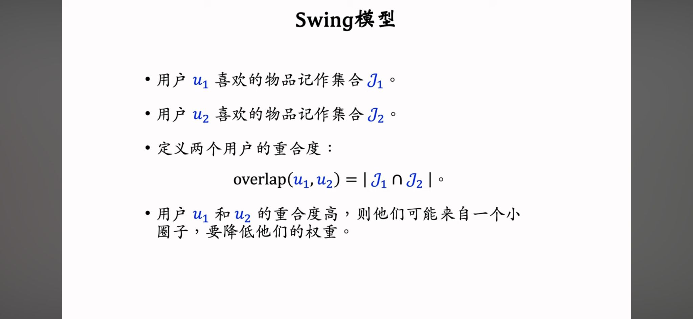
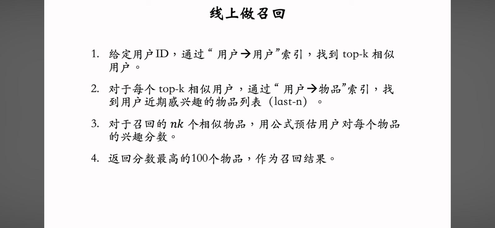
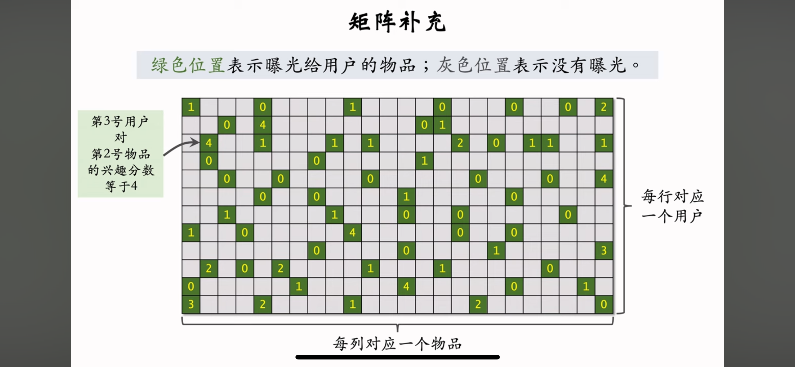

[Back to Log Page](./README.md) | [Back to Main Page](../../README.md)   

<h1>5/7/2024: Red Content Recommendation System Tutorial (Updated on 14/7/2024) </h1>

This is the summary of the [Red Content Recommendation System Tutorial](https://youtu.be/5dTOPen28ts?si=qhYBTACSpeeFZXqk). It shows an industrial approach to content recommendation.

## Table of Contents
- [Table of Contents](#table-of-contents)
- [Steps for Content Recommendation (CR) System](#steps-for-content-recommendation-cr-system)
- [Retrieval](#retrieval)
  - [**Collaborative Filtering (CF):**](#collaborative-filtering-cf)
  - [Discrete Features](#discrete-features)
  - [Matrix Completion \& Approximate Nearest Neighbor (ANN) Search](#matrix-completion--approximate-nearest-neighbor-ann-search)
  - [**Deep Structured Semantic Model (DSSM)**](#deep-structured-semantic-model-dssm)

## Steps for Content Recommendation (CR) System
1. **Retrieval** (reduce results from trillions to thousands)
   - It usually combines different methods (e.g., Collaborative Filtering, GNN) to retrieve results and aggregate them.

2. **Pre-Ranking** (reduce results from thousands to hundreds)
   - This is where neural networks are used to predict evaluation metrics (e.g., click-through rate, like rate).

3. **Ranking** (a more complex mechanism to rank results compared to pre-ranking)

4. **Re-Ranking** (reduce results from hundreds to tens)
   - It considers both scores and variety of the results, setting up rules to redistribute similar results.
   - It uses different sampling methods (e.g., MMR, DPP) to reduce results.
   - It also adds advertisements and additional information to the results.

## Retrieval
### **Collaborative Filtering (CF):**
   - This technique relies heavily on user behavior data to make recommendations, but it might be difficult to collect user data.

1. **Item CF:**

   
   If a user is interested in an item, they are more likely to be interested in similar items.

   
   Item CF requires two indexes to store user and item data. It is created and updated offline.
   
- **User-Item Index:** 

   Stores user behavior data (e.g., the past 100 clicks and other interactions) to determine user preferences (i.e., $like(user, item_j)$ ).

- **Item-Item Index:** 
  
   
   Stores content data to determine item similarity. When user groups are similar, the item groups are also considered similar. We usually use the Jaccard index or cosine similarity to determine if two items are similar.

- **Retrieval Procedure:**
  
   
   1. Given a *user_id*, return the ***last-n*** items the user has interacted with through the ***User-Item Index*** (assuming interest in these items).
   2. Using the ***last-n*** items, return the ***top-k*** similar items for each item through the ***Item-Item Index***.
   3. This method returns at most $n \times k$ similar results. It then predicts the interest score for each item.
   4. Return the top 100 results.

- **Misclassification of Similar Items:** 

   
   Two items may be considered similar if they are interacted with by a small group of users. It's possible that this small group consists of friends or people who share the same information sources through social media or communities. This can lead to misclassification of irrelevant items as similar.

   
   **Swing Model** is used to identify users from the same group and lower their weightings when calculating the similarity of two items.

2. **User CF:**

   
   If users are in the same group, they are more likely to be interested in similar items.

   
   Similar to Item CF, User CF requires two indexes to store user and item data. It is created and updated offline.

- **User-Item Index:**

   Stores user behavior data (e.g., the past 100 clicks and other interactions) to determine user preferences (i.e., $like(user, item_j)$ ).

- **User-User Index:**

   
   Store users similarity. Then, it can be used to determine if two users are similar.

- **Retrieval Procedure:**

   
   1. Given a *user_id*, return the ***top-k*** similar users through the ***User-User Index***.
   2. Using the ***top-k*** users, return the ***last-n*** items that each user has interacted with through the ***User-Item Index***.
   3. This method returns at most $n \times k$ similar results. It then predicts the interest score for each item.
   4. Return the top 100 results.

- **Misclassification of Similar Users:**
  
   Two users may be considered similar if they both interacted with popular items (e.g. classic movies, books, music).

   
   We need to lower the weighting of popular items (to reduce the effect to the user similarity).

### Discrete Features
This section will mention how we handle different discrete features (e.g. country, item_id, etc.). Discrete features are discontinuous and have definite features boundaries (i.e. fixed values).

1. **Dictionary:** One simple approach is to build a dictionary to map the features (e.g. China -> 1, US -> 2, India ->3)
2. **One-hot Encoding:** Project features into high dimension vector (e.g. gender: from male/female to 0/1). It creates columns for each feature value. However, when it is used in features with many values, it will create a high dimension vector (e.g. word, id, etc.).
3. **Embedding:** Project features into low dimension vector. It is trained on a large-scale dataset using a deep learning model.

<h4> What is Embedding?</h4>

We can use machine learning algorithms to find the parameter matrix that best fits the data (different feature values). Then, we can use the parameter matrix to map the feature values (one-hot encoding) to the embedding vectors. The use case will be explained in the next section, [**Matrix Completion**](#matrix-completion), although it is not used in the industrial approach.

### Matrix Completion & Approximate Nearest Neighbor (ANN) Search
Matrix completion is a technique used to fill in missing values in a matrix. For example, users may only interact with a small number of items (~3% of total items). Matrix completion can be used to fill in the missing values in the matrix. However, this approach is not used in the industry due to serval limitations. We can consider this method as the foundation of another powerful method, [**Deep Structured Semantic Model (DSSM)**](#deep-structured-semantic-model-dssm).

<h4> Steps for Matrix Completion: </h4>

We train the embedding layers for user_id and item_id respectively. Then, we can get the inner product of the two vectors.

We solve the minimization problem to get the optimized vectors A and B.

The final matrix can show user interest in different items.

<h4> Limitations: </h4>

- The model doesn’t consider other important features (e.g. item property, user attributes, etc.).
- The model doesn’t have a good negative samples mechanism. It counts toward no interaction which is an indirect source of information.

- The models uses inner product while Cosine similarity is the widely-used calculation method. Also, it uses Mean Square Error (MSE) instead of the Cross Entropy as the loss function in the minimization problem. Cross Entropy is a better function for discrete or categorical features while Mean Square Error is more suitable for continuous features.

<h4> How to use the model: </h4>

We store the optimized vectors A and B in the index table. Then, we can use the user_id as the key to retrieve the optimized vectors. Finally, we can get the inner product of the two vectors to get the interest score of the user in the item.
   - However, if we calculate the interest score of all users in the item, it will be too slow. We can should use the **Approximate Nearest Neighbor (ANN) Search** to accelerate the calculation.

<h4> Approximate Nearest Neighbor (ANN) Search</h4>

Systems that support ANN: Milvus, Faiss, HnswLib, etc.

Methods to find the nearest neighbors:
- Euclidean Distance (L2 norm)
- Inner Product
- Cosine Similarity

Depending on the method we choose, we will have different shape of areas for the vector results (e.g. Cosine Similarity -> Sector) when we pre-process the data. We can calculate the inner product of the two vectors to get the interest score of the user in the item. We can then find the nearest neighbors vector and get all the results through an index table.

### **Deep Structured Semantic Model (DSSM)**