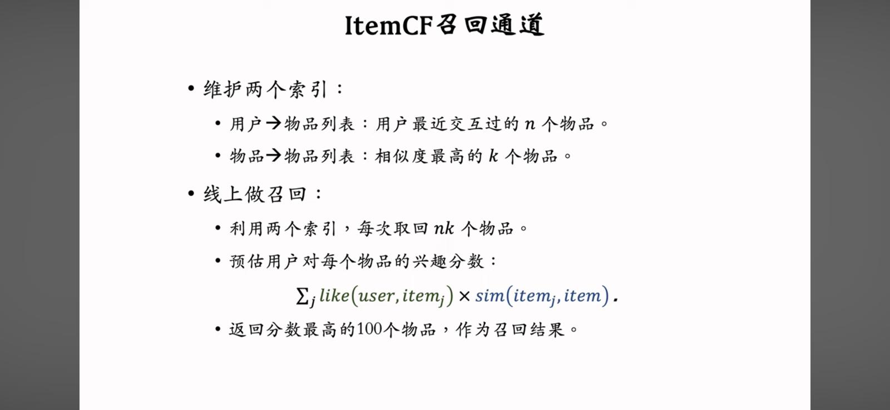
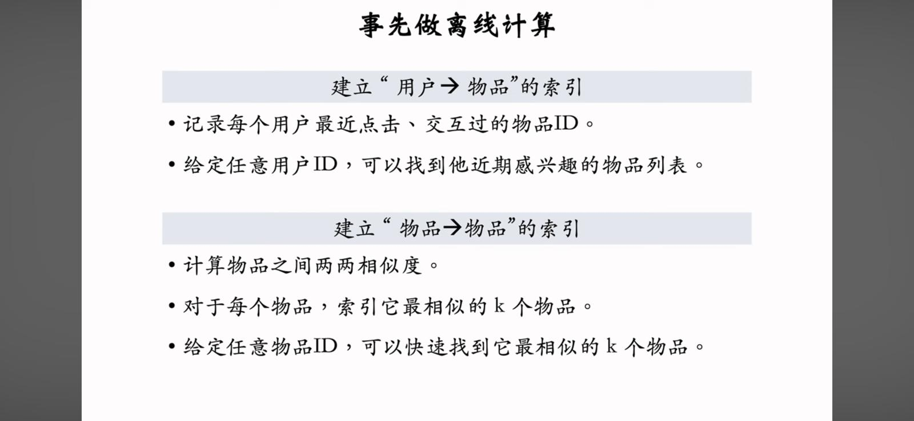
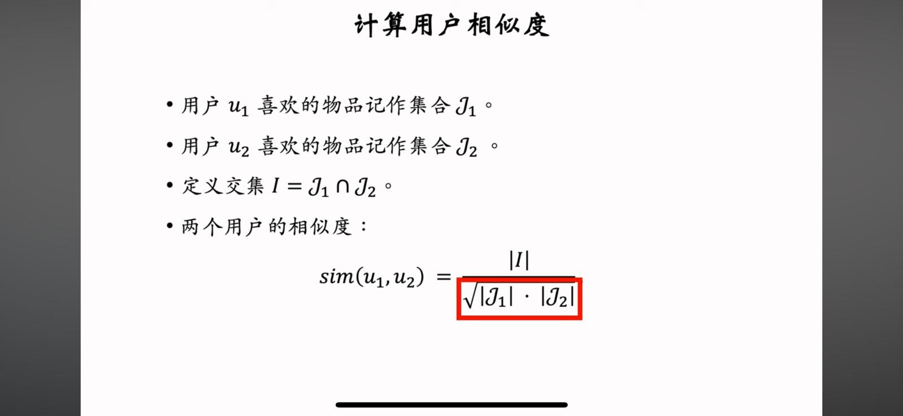

[Back to Main Page](../README.md)

<h1>5/7/2024: Red Content Recommendation System Tutorial (Updated on 10/7/2024) </h1>

This is the summary of the [Red Content Recommendation System Tutorial](https://youtu.be/5dTOPen28ts?si=qhYBTACSpeeFZXqk). It shows an industrial approach to content recommendation.

## Table of Contents
- [Table of Contents](#table-of-contents)
- [Steps for Content Recommendation (CR) System](#steps-for-content-recommendation-cr-system)
- [Retrieval](#retrieval)
  - [**Collaborative Filtering (CF):**](#collaborative-filtering-cf)
  - [**Discrete Features**](#discrete-features)

## Steps for Content Recommendation (CR) System
1. **Retrieval** (reduce results from trillions to thousands)
   - It usually combines different methods (e.g., Collaborative Filtering, GNN) to retrieve results and aggregate them.

2. **Pre-Ranking** (reduce results from thousands to hundreds)
   - This is where neural networks are used to predict evaluation metrics (e.g., click-through rate, like rate).

3. **Ranking** (a more complex mechanism to rank results compared to pre-ranking)

4. **Re-Ranking** (reduce results from hundreds to tens)
   - It considers both scores and variety of the results, setting up rules to redistribute similar results.
   - It uses different sampling methods (e.g., MMR, DPP) to reduce results.
   - It also adds advertisements and additional information to the results.

## Retrieval
### **Collaborative Filtering (CF):**
   - This technique relies heavily on user behavior data to make recommendations, but it might be difficult to collect user data.

1. **Item CF:**

   
   If a user is interested in an item, they are more likely to be interested in similar items.

   
   Item CF requires two indexes to store user and item data. It is created and updated offline.
   
- **User-Item Index:** 

   Stores user behavior data (e.g., the past 100 clicks and other interactions) to determine user preferences (i.e., $like(user, item_j)$ ).

- **Item-Item Index:** 
  
   
   Stores content data to determine item similarity. When user groups are similar, the item groups are also considered similar. We usually use the Jaccard index or cosine similarity to determine if two items are similar.

- **Retrieval Procedure:**
  
   
   1. Given a *user_id*, return the ***last-n*** items the user has interacted with through the ***User-Item Index*** (assuming interest in these items).
   2. Using the ***last-n*** items, return the ***top-k*** similar items for each item through the ***Item-Item Index***.
   3. This method returns at most $n \times k$ similar results. It then predicts the interest score for each item.
   4. Return the top 100 results.

- **Misclassification of Similar Items:** 

   
   Two items may be considered similar if they are interacted with by a small group of users. It's possible that this small group consists of friends or people who share the same information sources through social media or communities. This can lead to misclassification of irrelevant items as similar.

   
   **Swing Model** is used to identify users from the same group and lower their weightings when calculating the similarity of two items.

2. **User CF:**

   
   If users are in the same group, they are more likely to be interested in similar items.

   
   Similar to Item CF, User CF requires two indexes to store user and item data. It is created and updated offline.

- **User-Item Index:**

   Stores user behavior data (e.g., the past 100 clicks and other interactions) to determine user preferences (i.e., $like(user, item_j)$ ).

- **User-User Index:**

   
   Store users similarity. Then, it can be used to determine if two users are similar.

- **Retrieval Procedure:**

   
   1. Given a *user_id*, return the ***top-k*** similar users through the ***User-User Index***.
   2. Using the ***top-k*** users, return the ***last-n*** items that each user has interacted with through the ***User-Item Index***.
   3. This method returns at most $n \times k$ similar results. It then predicts the interest score for each item.
   4. Return the top 100 results.

- **Misclassification of Similar Users:**
  
   Two users may be considered similar if they both interacted with popular items (e.g. classic movies, books, music).

   
   We need to lower the weighting of popular items (to reduce the effect to the user similarity).

### **Discrete Features**
